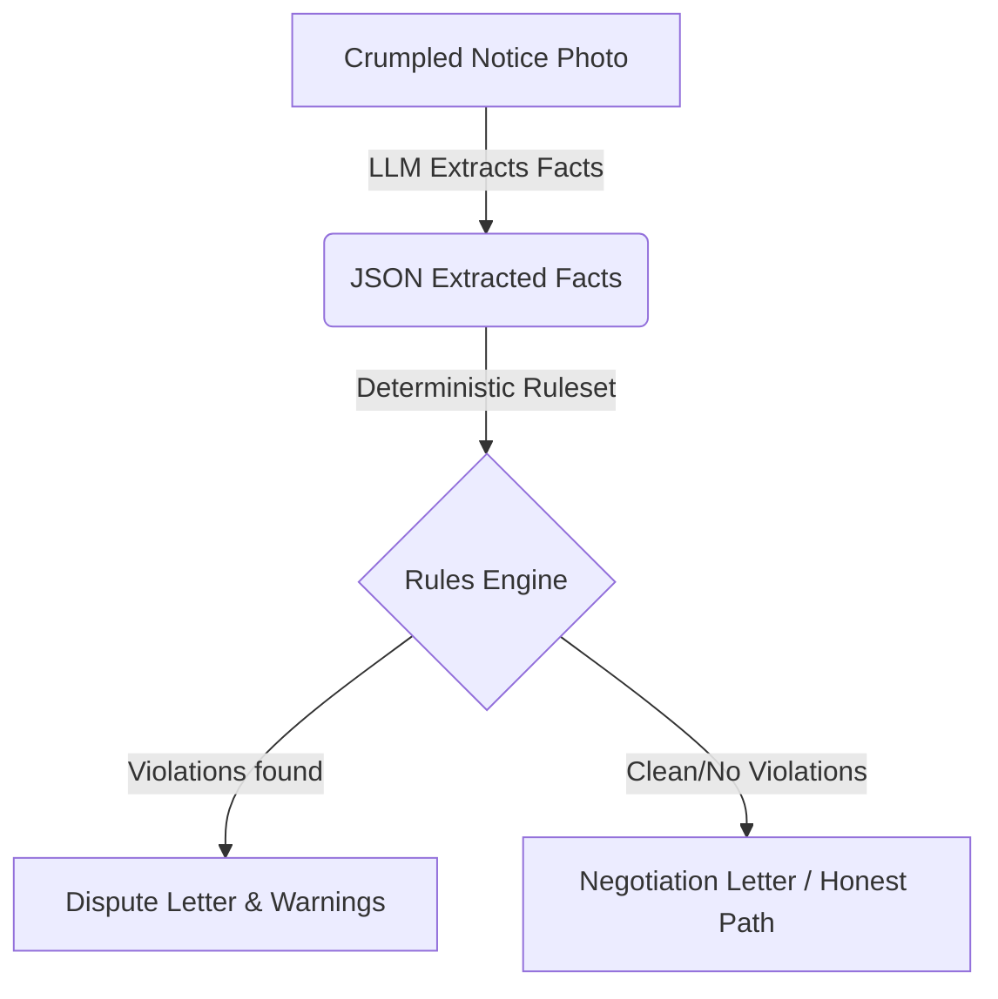

# CounterNotice

**Live Demo:** [https://counternotice.vercel.app](https://counternotice.vercel.app)  
**GitHub Repository:** [https://github.com/manojmulammagari/CounterNotice](https://github.com/manojmulammagari/CounterNotice)

CounterNotice transforms a crumpled paper eviction notice into a cited legal defense in under 20 seconds. Built for LexHack 2026.

## Architecture

We use AI strictly for extraction, and a deterministic engine for legal evaluation. The LLM never invents claims or legal conclusions.



## Key Features & Code Map

- **AI Fact Extraction** (`src/lib/extraction/gemini.ts`): Uses Gemini 2.0 Flash to extract structured facts matching our exact schema (`src/lib/engine/types.ts`).
- **Deterministic Rules Engine** (`src/lib/engine/evaluate.ts`): Evaluates facts against the frozen Texas Property Code § 24.005 ruleset (`src/lib/rules/tx-24-005.rules.json`).
- **Deadline Calculator** (`src/lib/deadline/compute.ts`): Precisely calculates response deadlines and earliest filing dates.
- **Strict Response Letter Templates** (`src/lib/letter/template.ts`): Generates response letters (Dispute or Negotiation) exactly mapping to findings, without hallucinated legal claims.
- **Voice Read-Aloud** (`src/lib/voice/phrases.ts` & `src/lib/voice/player.ts`): Voice integration using Kokoro AI (with MP3s in `public/voice/`) to dictate exact legal outcomes.
- **Demo Lock & Guardrails** (`src/lib/guardrails/verify.ts`): Enforces safe fallbacks and verifiable safety properties in the application.

## Guardrail Audit

CounterNotice includes an automated guardrail audit to mathematically verify that the system never produces false accusations for out-of-jurisdiction, unknown, or unreadable notices.

Run the guardrail audit command:
```bash
npx tsx -e "import { auditGuardrails } from './src/lib/guardrails/verify'; console.log(auditGuardrails())"
```

## 2:45 Demo Video Script

```text
# CounterNotice — Demo Video Outline

## Introduction (0:00 - 0:30)
- "Hi, I'm the developer of CounterNotice."
- Explain the problem: Tenants receive confusing eviction notices and don't know their rights.
- Show a crumpled, defective 2-day notice.
- "We built a tool that reads the notice, checks it against Texas law, and drafts a legal response—in 20 seconds."

## The Demo (0:30 - 1:30)
- (App runs in DEMO_MODE, ensuring no live API hiccups)
- Click "Take or choose a photo".
- Select the defective notice.
- (Wait for analysis spinner)
- Show the **VerdictCard** (Red warning: "We found 2 possible problem(s) with this notice.").
- Click "Read my rights aloud" (Plays Kokoro audio).
- Scroll to **DeadlineShield**: "Today is the last day."
- Scroll to **WhyPanel**: Show the side-by-side comparison of the notice vs. the exact Texas law.
- Scroll down to the drafted **ResponseLetter**.

## Response Letter & Honest Path (1:30 - 2:30)
- Emphasize that the letter is strictly formatted. No hallucinations.
- Show the "WHAT THIS MEANS IN SIMPLE WORDS" translation.
- Click "Check another notice".
- Click "Clean 3-day notice" sample.
- Show the green **VerdictCard** and explain the "Honest Path" (Negotiation letter). 
- Explain that we NEVER invent violations.

## Conclusion (2:30 - 2:45)
- "This letter tells your landlord: 'Your paper has mistakes. Here are the exact Texas laws that show the mistakes. Please take back the paper and start again the right way.' It also tells them the date by which you must respond. You are protecting yourself by putting everything in writing."
- Mention the disclaimer: "This is not legal advice."
- End video.
```

## Rubric Checklist

- **Real-World Impact:** CounterNotice immediately empowers tenants facing imminent eviction by translating complex notices into actionable, cited letters and precise deadlines (`src/components/ResponseLetter.tsx`, `src/lib/deadline/compute.ts`).
- **Technical Execution:** The robust architecture gracefully combines LLM structured extraction with a strict deterministic evaluation engine and passing unit tests (`src/lib/engine/evaluate.ts`, `src/lib/extraction/gemini.ts`).
- **User Experience:** The UI is mobile-first, provides offline demo modes, features clear 5th-grade reading level explanations, and incorporates voice read-alouds for high accessibility (`src/app/page.tsx`, `src/lib/voice/player.ts`).
- **Innovation & AI Safety:** By separating LLM fact extraction from the deterministic legal rules engine, the application mathematically eliminates hallucinated legal conclusions (`src/lib/guardrails/verify.ts`, `src/lib/rules/tx-24-005.rules.json`).
- **Presentation & Documentation:** This repository includes a full automated guardrail audit, clear architecture diagrams, comprehensive tests, and a flawless demo presentation script to prove exactly how it works safely.
