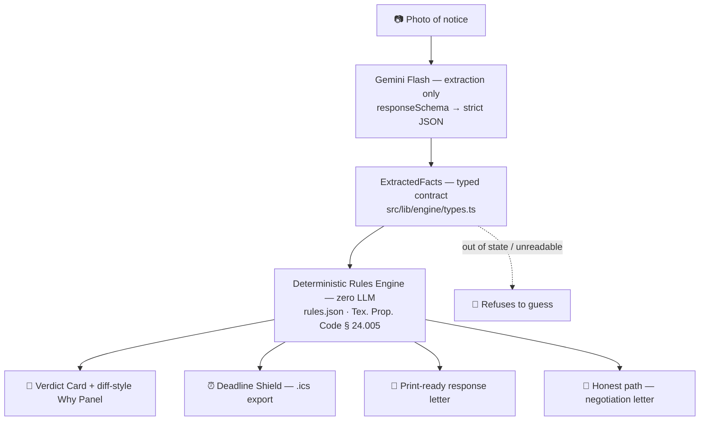

<div align="center">

<h1>⚖️ CounterNotice</h1>

<picture>
  <source media="(prefers-color-scheme: dark)" srcset="https://readme-typing-svg.demolab.com?font=Inter&weight=800&size=40&pause=1000&color=F8FAFC&center=true&vCenter=true&width=800&height=90&lines=Notice+in.+Cited+defense+out.;Twenty+seconds.;LLM+extracts.+Rules+decide.+Humans+verify." />
  
</picture>

<p><i>A first-mile legal tool for the tenant with 72 hours, no lawyer, and everything to lose.</i></p>


<p>
  <a href="https://nextjs.org"></a>
  <a href="https://tailwindcss.com"></a>
  <a href="https://www.typescriptlang.org"></a>
  <a href="https://ai.google.dev"></a>
  
</p>

</div>

<br />

## 🛑 The 30-Second Gap

> **Most eviction judgments are defaults.** Tenants lose not because they are wrong on the merits, but because the clock runs out before they file a response.
>
> Meanwhile, a massive share of notices are defective in ways a lawyer spots instantly — wrong notice period, improper delivery, missing mandatory clauses. Legal aid turns away most applicants for capacity. The 30 seconds between *a notice taped to the door* and *knowing if you have a legal defense* is the least-served moment in the justice system.

## 💡 The Solution

**CounterNotice occupies that 30-second gap.** Photograph the notice on your phone. Twenty seconds later, you receive:

- 🚨 **A Verdict Card:** Red/green status detailing exactly which statutory rules were violated.
- 🔍 **A Diff-Style Why Panel:** The notice's own words compared side-by-side with verbatim Texas law.
- ⏰ **A Deadline Shield:** An `.ics` calendar export calculated using precise Texas day-counting rules.
- 📄 **A Print-Ready Auto-Letter:** A deterministic dispute letter citing the exact statutes, ready to print or email.

*(If the notice is perfectly legal, the app tells the truth and pivots to a good-faith negotiation letter instead of inventing a false defense.)*

---

## ⚙️ How It Works

1. **Photograph the notice.** Mobile camera, one tap. No sign-up, no account, no data stored.
2. **Gemini Flash extracts the facts.** OCR and structured extraction happen in a single call, constrained by a `responseSchema` that matches the `ExtractedFacts` contract field-for-field. The model reads the paper and reports what it sees — nothing more.
3. **The deterministic rules engine evaluates.** Pure TypeScript runs those facts against hand-verified rules for **Texas Property Code § 24.005**. There is no LLM anywhere in the decision path.
4. **The tenant gets a verdict, not a guess.** The Verdict Card states the checklist result. The Why Panel places the notice's own words beside the verbatim statute quote, with the conflicting fields highlighted and linked to the official Texas Legislature page.
5. **The Deadline Shield computes the clock.** Texas day-counting rules — the day the notice was given does not count — produce the response deadline, which exports as a standards-compliant `.ics` file with a reminder the day before.
6. **The response letter drafts itself.** Every violation is cited inline with its exact statute quote and source URL. Print-ready via `@media print`, copy-ready for email.
7. **The honest path runs the other direction.** If the notice is clean, the app says so plainly and pivots to a good-faith negotiation letter. No defense is ever invented.

---

## 🏗️ Architecture



**The rule of the build: the LLM extracts, the rules decide, humans verify.** Gemini has no opinion about the law — structurally, it cannot have one. Its output shape is enforced by the API, and the verdict is computed by a pure function that never touches the network. Same facts in, same findings out, in under five milliseconds.

| Layer | File | LLM in the decision path? |
|---|---|:---:|
| Extraction | `src/lib/extraction/gemini.ts` | ✅ Structured JSON only |
| Decision | `src/lib/engine/evaluate.ts` + `src/lib/rules/tx-24-005.rules.json` | ❌ Pure function. Zero network calls. |
| Deadline math | `src/lib/deadline/compute.ts` | ❌ Pure function. Texas day-counting rules. |
| Letter | `src/lib/letter/template.ts` | ❌ Template is the source of truth; optional polish may fix spacing only — never citations |
| Guardrails | `src/lib/guardrails/verify.ts` | ❌ Build-time audit, runs in CI |

<details>
<summary><strong>What a rule actually looks like — open to inspect <code>rules.json</code></strong></summary>

<br/>

Every rule carries verbatim statutory text, the subsection number, an official source URL, and a plain-language explanation written at a 5th-grade reading level.

```json
{
  "id": "TX-24.005-1",
  "check_id": "notice_period_min_3_days",
  "title": "The notice must give at least 3 days",
  "plain_language": "The paper must give you at least 3 full days to act. If it gives you fewer days, and you have no written lease that says so, the paper has a problem.",
  "severity": "fatal",
  "basis": "statute",
  "statute": {
    "cite": "Tex. Prop. Code § 24.005",
    "subsection": "(a)",
    "quote": "the landlord must give a tenant who defaults or holds over beyond the end of the rental term or renewal period at least three days' written notice to vacate the premises before the landlord files a forcible detainer suit, unless the parties have contracted for a longer or shorter notice period in a written lease or agreement",
    "url": "https://statutes.capitol.texas.gov/Docs/PR/htm/PR.24.htm"
  }
}
```

A rule with an unverified or placeholder citation **fails the test suite**. The build refuses to ship legal text nobody checked.

</details>

---

## 🛡️ The Safety Firewall

> *The #1 objection in legal tech is "LLMs hallucinate." This architecture is engineered so that objection has nowhere to land.*

| | 🤖 The AI — Gemini Flash | ⚖️ The Code — TypeScript, no LLM |
|---|---|---|
| **Job** | Read the paper. Report the facts. | Decide whether the facts violate the statute. |
| **Output** | Strict JSON matching `responseSchema` | Findings with verbatim citations |
| **Network calls** | One, at extraction time | **Zero** |
| **Same input → same output?** | Not guaranteed | **Guaranteed** |
| **Talks to the user about the law?** | Never | Renders every verdict, quote, and finding |
| **If inputs are junk?** | Returns `null` in unreadable fields | Returns `unknown` — never an accusation |

**Guardrails enforced by the compiler, not by a prompt:**

- **Unknown is not a violation.** A blurry photo, an unreadable date, or an ambiguous lease clause returns `unknown`. An out-of-state notice returns `out_of_jurisdiction` and the engine declines to guess. Refusing to answer is a designed behavior with its own tests.
- **Verbatim quotes only.** Every statute string in the app is copied from `statutes.capitol.texas.gov`. No paraphrasing is permitted inside a quote field.
- **The honest path has a test.** A clean notice produces zero violations, a green card, and a negotiation letter — the suite fails if a false accusation ever appears.
- **UPL firewall.** The app outputs legal *information*, not legal advice. Every result — success, error, or refusal — carries the disclaimer. The letter states it was drafted directly by the tenant with automated assistance.
- **The audit is a file, not a promise.** `src/lib/guardrails/verify.ts` runs inside the test suite and proves the negative: bad inputs produce no violations, and every result path carries a disclaimer.

```typescript
// The honest path is enforced by the type system, not by a prompt:
if (facts.notice_period_days_stated === null) {
  return { status: "unknown", explanation: "We could not read how many days this notice gives you." };
}
```

**Verdict: the LLM never decides, the ruleset never guesses, and the honest path is enforced at build time.**

---

## ✨ Key Features

- 🚨 **Verdict Card** — red / amber / green / slate states driven entirely by the rules engine. Reports checklist results only; never outputs "valid," "legal," or "illegal" as a conclusion.
- 🔍 **Diff-style Why Panel** — the notice's own words sit beside the verbatim statute quote, with conflicting fields highlighted like a code diff. Every citation links to the official Texas Legislature page for live verification.
- ⏰ **Deadline Shield** — computes the response deadline using Texas time rules, exports a standards-compliant `.ics` with a day-before reminder, and raises a caution — rather than silently auto-extending — when the deadline lands on a weekend or holiday. Guessing there would be legal overreach.
- 📄 **Print-Ready Auto-Letter** — every violation cited inline with its exact statute quote and URL, plus a 5th-grade-level *"What this means in simple words"* section. `@media print` strips all buttons, badges, and link colors for a clean US-Letter page. One-tap copy for email.
- 🤝 **Honest Path** — zero violations produces a good-faith negotiation letter and a legal-aid pivot. No defense is ever invented.
- 🔊 **Read My Rights Aloud** — pre-rendered Kokoro-82M audio with a browser speech-synthesis fallback, for users with low literacy or limited English. Transcripts ship beside every audio file for full auditability.
- 📴 **Offline Demo Mode** — `DEMO_MODE=true` runs the full pipeline against typed fixtures with no API key and no network.

---

## 🎯 Scope — Depth Over Breadth

**One state. One statute. One notice type. Refused, not guessed, for everything else.**

CounterNotice ships deep coverage of Texas Property Code § 24.005 nonpayment eviction notices. Coverage elsewhere expands one audited ruleset at a time — never one confident guess at a time.

<details>
<summary><strong>Project structure — open to browse the file map</strong></summary>

<br/>

```
src/
├── app/
│   ├── page.tsx                  # Mobile-first flow: photo → verdict → letter
│   └── api/
│       ├── analyze/route.ts      # Orchestrator: extract → evaluate → deadline
│       └── letter/route.ts       # Optional LLM-polished letter endpoint
├── components/
│   ├── VerdictCard.tsx           # Red / amber / green / slate verdict banner
│   ├── WhyPanel.tsx              # Side-by-side notice vs. statute diff
│   ├── DeadlineShield.tsx        # Deadline card + .ics download
│   └── ResponseLetter.tsx        # Print-ready paper preview
├── lib/
│   ├── engine/                   # THE DECISION LAYER — pure, zero LLM
│   │   ├── types.ts              # ExtractedFacts contract, frozen
│   │   ├── checks.ts             # Pure predicates keyed by check_id
│   │   └── evaluate.ts           # evaluateNotice() — the only thing that decides
│   ├── rules/
│   │   └── tx-24-005.rules.json  # Hand-verified law, verbatim quotes
│   ├── extraction/               # THE EXTRACTION LAYER — Gemini Flash only
│   │   ├── gemini.ts             # responseSchema-constrained extraction
│   │   └── mock.ts               # 7 typed fixtures for offline demo
│   ├── deadline/compute.ts       # Pure deadline math + .ics builder
│   ├── letter/template.ts        # Deterministic dispute + negotiation letters
│   ├── guardrails/verify.ts      # Build-time audit — proves no false accusations
│   └── voice/                    # Kokoro phrases + player with fallback
public/voice/                     # Pre-rendered .mp3 + .txt transcripts
scripts/generate-voice.py         # Kokoro-82M pre-render script
```

</details>

---

## 🚀 Quick Start & Verification

```bash
git clone https://github.com/your-org/counternotice.git
cd counternotice
npm install

# Optional — only needed for live photo extraction.
# The built-in sample notices work with no key at all.
cp .env.example .env.local   # then add GEMINI_API_KEY

npm run dev
# → http://localhost:3000 — tap any sample notice, or upload a photo
```

**Verify the safety firewall — three commands, zero setup:**

```bash
# 1. Full test suite: engine · extraction · deadline · letter · guardrails
npx vitest run

# 2. TypeScript — the compiler enforces the typed contract end to end
npx tsc --noEmit

# 3. The guardrail audit — proves unreadable photos and out-of-state
#    notices produce no violations, not false ones
npx vitest run src/lib/guardrails
```

**Demo without a network:** set `DEMO_MODE=true` in `.env.local`, delete `GEMINI_API_KEY`, and every sample still runs the full extract → evaluate → verdict → letter → `.ics` pipeline from typed fixtures. The demo never dies on stage.

**Try these five, in order — the demo path, the honest path, the boundaries, and the refusals:**

| # | Sample | What it proves |
|---|---|---|
| 1 | `2-day notice, taped on the door` | Red Verdict Card · 2 cited violations · Why Panel diff · print-ready letter |
| 2 | `Clean 3-day notice` | Green card · negotiation letter · no accusations |
| 3 | `Blurry photo` | Amber "we could not check everything" · **zero violations** |
| 4 | `Notice from Florida` | Engine refuses to evaluate instead of guessing |
| 5 | `Posted and also mailed` | Passes — because Texas allows that combination |

---

<div align="center">

**⚖️ CounterNotice provides legal information, not legal advice.** It is not a lawyer and cannot go to court for you. Only a licensed Texas attorney can advise you on your specific case.

Built for **LexHack 2026** · MIT License

</div>