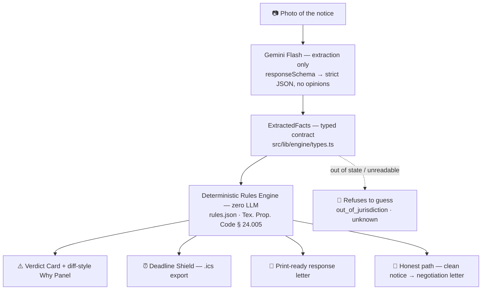

<div align="center">

# CounterNotice

**Crumpled eviction notice → cited statutory defense in 20 seconds.**

*A first-mile legal tool for the tenant who has 72 hours, no lawyer, and everything to lose.*


[](https://nextjs.org)
[](https://tailwindcss.com)
[](https://www.typescriptlang.org)
[](https://ai.google.dev)


</div>

---

## The Problem

**Most tenants who lose eviction cases never get to tell their side of the story.** They lose by default — the clock runs out before they ever file a response. And a large share of the notices that start that clock are defective in ways a lawyer spots instantly: too few days to respond, improper delivery, a demand that never actually tells the tenant to leave.

Legal aid cannot close the gap — most applicants are turned away for capacity. The 30 seconds between *notice on the door* and *do I have a defense?* is the least-served moment in the entire legal system.

## The Fix

**CounterNotice is that 30 seconds.** The tenant photographs the notice. Twenty seconds later:

- Every legally relevant fact is extracted into a typed schema.
- The facts are checked against a hand-curated ruleset for **Texas Property Code § 24.005** — a deterministic engine, not an LLM.
- The tenant receives a **Verdict Card** with each violation paired to the exact statute text and an official source link, a **print-ready response letter**, and a **deadline shield** dropped into their calendar.

**If the notice is clean, the app says so** — and pivots to a negotiation letter instead of inventing a defense. A tool that tells an anxious user truth they don't want to hear is the feature.

---

## Architecture



**The rule of the build: LLM extracts, rules decide, humans verify.** Gemini Flash has no opinion about the law — structurally, it cannot. Its output is constrained by a `responseSchema` matching `ExtractedFacts` field-for-field, and the verdict is computed by pure TypeScript that never touches the network. Same facts in, same findings out, in under 5 milliseconds.

### Where the logic lives

| Layer | File | LLM in the decision path? |
|---|---|---|
| Extraction | `src/lib/extraction/gemini.ts` | ✅ Gemini Flash — structured JSON only |
| Decision | `src/lib/engine/evaluate.ts` + `src/lib/rules/tx-24-005.rules.json` | ❌ Zero LLM calls. Pure function. |
| Deadline math | `src/lib/deadline/compute.ts` | ❌ Pure function — Texas day-counting rules |
| Letter | `src/lib/letter/template.ts` | ❌ Template is the source of truth; optional LLM polish may fix spacing only — never citations |
| Guardrails | `src/lib/guardrails/verify.ts` | ❌ Build-time audit, runs in CI |

---

## Key Features

- 🚨 **Verdict Card** — red / amber / green / slate states driven entirely by the rules engine. Never outputs "valid," "legal," or "illegal" as a conclusion — it reports checklist results only.
- 🔍 **Diff-style Why Panel** — the notice's own words sit side-by-side with the verbatim statute quote, and the conflicting fields are highlighted like a code diff. Every citation links to the official Texas Legislature page for live verification.
- ⏰ **Deadline Shield** — computes the response deadline using Texas time rules (the day the notice was given does not count) and exports a standards-compliant `.ics` file with a reminder the day before. When the deadline lands on a weekend or holiday, it raises a caution instead of silently auto-extending — because guessing is legal overreach.
- 📄 **Print-ready Auto-Letter** — a deterministic response letter citing each discovered violation with its exact statute quote and URL, plus a 5th-grade-level "What this means in simple words" section. `@media print` CSS strips every button, badge, and hyperlink color so a tenant with a library printer gets a clean US-Letter page. One-tap copy for email.
- 🤝 **Honest Path** — zero violations produces a good-faith negotiation letter and a legal-aid pivot. No false accusations, ever.
- 🔊 **Read My Rights Aloud** — pre-rendered Kokoro-82M audio with a browser speech-synthesis fallback, for users with low literacy or limited English. Transcripts ship alongside every audio file for full auditability.
- 🛡️ **Build-time Guardrail Audit** — an automated check proving that unreadable photos and out-of-state notices produce *no* violations, not false ones.
- 📴 **Offline Demo Mode** — `DEMO_MODE=true` runs the full pipeline against typed fixtures with no API key and no network. The demo never dies on stage.

---

## AI Safety & Guardrails

> *The #1 objection in legal tech is "LLMs hallucinate." CounterNotice is engineered so that objection has nowhere to land.*

**1. The LLM is an OCR extractor — not a decision-maker.**
Gemini Flash receives the photo and returns strict JSON constrained by a `responseSchema`. It physically cannot return a shape the engine doesn't expect, and it is never asked whether a notice is compliant. Its entire job: read the paper, report the facts.

**2. The decision boundary is deterministic.**
`evaluateNotice(facts, ruleset)` is a pure TypeScript function. Zero network calls, zero randomness, zero LLM. The same inputs always produce the same findings. The verdict is reproducible in a courtroom-grade sense — you can re-run it in front of a judge.

**3. Every rule is hand-verified and citation-linked.**
`rules.json` contains only verbatim statutory quotes with subsection numbers and official `statutes.capitol.texas.gov` URLs. A rule with an unverified citation **fails the test suite** — the build refuses to ship legal text nobody checked.

**4. Unknown is not a violation.**
A blurry photo, an unreadable date, or an ambiguous lease clause returns `unknown` — never an accusation. An out-of-state notice returns `out_of_jurisdiction` and the engine declines to guess. Refusing to answer is a designed behavior with its own tests.

```typescript
// The honest path is enforced by the type system, not by a prompt:
if (facts.notice_period_days_stated === null) {
  return { status: "unknown", explanation: "We could not read how many days this notice gives you." };
}
```

**5. UPL firewall.**
CounterNotice outputs **legal information**, not legal advice. Every result — success, error, or refusal — carries the disclaimer. The letters state they were drafted directly by the tenant with automated assistance. There is no attorney-client relationship, and the app never tells anyone they will win.

**6. The guardrail audit is a file, not a promise.**
`src/lib/guardrails/verify.ts` runs as part of the test suite and proves the negative: bad inputs produce no violations.

```bash
npx vitest run        # engine · extraction · deadline · letter · guardrail suites
npx tsc --noEmit      # the compiler enforces the typed contract end to end
```

**Verdict:** the LLM never decides, the ruleset never guesses, and the honest path is enforced by the compiler.

---

## Quick Start

```bash
git clone https://github.com/your-org/counternotice.git
cd counternotice
npm install

# Optional — only needed for live photo extraction.
# The built-in sample notices work with no key at all.
cp .env.example .env.local   # then add GEMINI_API_KEY

npm run dev
# → http://localhost:3000 — tap any sample notice, or upload a photo
```

**Verify the safety firewall in two commands:**

```bash
npx vitest run     # all suites must pass, including the guardrail audit
npx tsc --noEmit   # exit 0 — types are the contract between every layer
```

**Demo without a network:** set `DEMO_MODE=true` in `.env.local`, delete `GEMINI_API_KEY`, and every sample still runs the full extract → evaluate → verdict → letter → `.ics` pipeline from typed fixtures.

**Try these five, in order** — they are the demo path, the honest path, the boundary cases, and the refusals:

1. `2-day notice, taped on the door` → red Verdict Card, 2 cited violations, Why Panel diff, print-ready letter
2. `Clean 3-day notice` → green card, negotiation letter, no accusations
3. `Blurry photo` → amber "we could not check everything" — zero violations
4. `Notice from Florida` → the engine refuses to evaluate instead of guessing
5. `Posted and also mailed` → passes, because Texas allows that combination

---

## Scope — Depth Over Breadth

**One state. One statute. One notice type. Refused, not guessed, for everything else.**

CounterNotice ships deep coverage of Texas Property Code § 24.005 nonpayment eviction notices, with every rule hand-verified against the official statute text. Coverage elsewhere expands one audited ruleset at a time — never one confident guess at a time.

---

<div align="center">

**⚖️ CounterNotice provides legal information, not legal advice.** It is not a lawyer and cannot go to court for you. Only a licensed Texas attorney can advise you on your specific case.

Built for **LexHack 2026** · MIT License

</div>